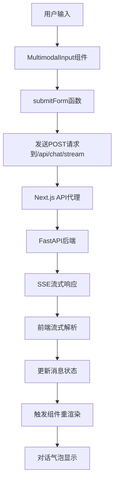
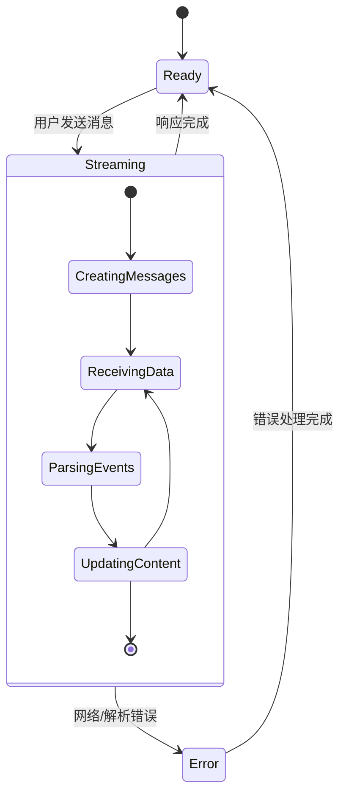

# snowflake backend config

## API数据处理与对话气泡渲染机制详解

### 📋 概述

本文档详细分析AI聊天机器人中API返回数据的处理流程，以及如何将这些数据渲染成用户界面中的对话气泡。

### 🔄 完整数据流程图



### 🌊 1. API数据处理机制

#### 1.1 请求发送阶段

**位置**: `components/chat.tsx:88-99`

```typescript
const response = await fetch('/api/chat/stream', {
  method: 'POST',
  headers: {
    'Content-Type': 'application/json',
  },
  body: JSON.stringify({
    message: input,        // 用户输入的消息
    chatId: id,           // 聊天会话ID
    model: initialChatModel,  // AI模型选择
  }),
});
```

#### 1.2 API路由代理

**位置**: `app/(chat)/api/chat/stream/route.ts`

```typescript
export async function POST(request: Request) {
  const { message, chatId, model } = await request.json();
  
  // 构建后端请求
  const backendRequest = {
    message,
    enable_streaming: true,
    session_id: chatId || 'default',
  };
  
  // 转发到FastAPI后端
  const response = await fetch(backendUrl, {
    method: 'POST',
    headers: {
      'Content-Type': 'application/json',
      'ngrok-skip-browser-warning': 'true',
    },
    body: JSON.stringify(backendRequest),
  });
  
  // 直接代理后端的流式响应
  return new Response(response.body, {
    headers: {
      'Content-Type': 'text/event-stream',
      'Cache-Control': 'no-cache',
      'Connection': 'keep-alive',
    },
  });
}
```

#### 1.3 SSE数据格式

后端返回的数据格式遵循Server-Sent Events (SSE)标准：

```
data: {"type": "agent_response", "content": "Hello"}

data: {"type": "system_log", "category": "orchestration", "content": "Processing..."}

data: {"type": "agent_lifecycle", "category": "agent_start", "content": "Starting analysis"}

data: {"type": "system_result", "category": "completion", "content": "Task completed"}
```

### 🔧 2. 流式数据解析

#### 2.1 ReadableStream处理

**位置**: `components/chat.tsx:105-164`

```typescript
// 获取流式响应的读取器
const reader = response.body?.getReader();
const decoder = new TextDecoder();

let buffer = '';
let assistantContent = '';

while (true) {
  const { done, value } = await reader.read();
  
  if (done) break;
  
  // 解码二进制数据为文本
  buffer += decoder.decode(value, { stream: true });
  
  // 按行分割数据
  const lines = buffer.split('\n');
  buffer = lines.pop() || ''; // 保留未完成的行
  
  // 处理每一行数据
  for (const line of lines) {
    if (line.startsWith('data: ')) {
      // 解析JSON事件
      const event = JSON.parse(line.slice(6));
      // 处理事件...
    }
  }
}
```

#### 2.2 事件类型处理

```typescript
let textContent = '';

if (event.type === 'agent_response') {
  // AI回复内容
  if (typeof event.content === 'string' && event.content.trim()) {
    textContent = event.content;
  }
} else if (event.type === 'system_log') {
  // 系统日志
  if (event.category === 'orchestration' || event.category === 'completion') {
    textContent = `\n🔄 *${event.content}*\n`;
  }
} else if (event.type === 'agent_lifecycle') {
  // 代理生命周期
  if (event.category === 'agent_start') {
    textContent = `\n🚀 ${event.content}\n`;
  } else if (event.category === 'agent_complete') {
    textContent = `\n✅ ${event.content}\n`;
  }
} else if (event.type === 'system_result' && event.category === 'completion') {
  // 分析总结
  textContent = `\n\n# 📋 Analysis Summary\n\n${event.content}\n`;
}
```

### 🎨 3. 对话气泡渲染机制

#### 3.1 消息状态更新

**位置**: `components/chat.tsx:149-158`

```typescript
if (textContent) {
  // 累积内容
  assistantContent += textContent;
  
  // 更新特定消息的内容
  setMessagesState(prev => prev.map(msg => 
    msg.id === assistantMessage.id 
      ? { ...msg, content: assistantContent }
      : msg
  ));
}
```

#### 3.2 消息容器渲染

**位置**: `components/messages.tsx:42-80`

```jsx
<div className="flex flex-col min-w-0 gap-6 flex-1 overflow-y-scroll pt-4">
  {messages.length === 0 && <Greeting />}

  {messages.map((message, index) => (
    <PreviewMessage
      key={message.id}
      chatId={chatId}
      message={message}
      isLoading={status === 'streaming' && messages.length - 1 === index}
      vote={votes?.find((vote) => vote.messageId === message.id)}
      setMessages={setMessages}
      reload={reload}
      isReadonly={isReadonly}
      requiresScrollPadding={hasSentMessage && index === messages.length - 1}
    />
  ))}

  {/* 思考中状态 */}
  {status === 'submitted' &&
    messages.length > 0 &&
    messages[messages.length - 1].role === 'user' && <ThinkingMessage />}
</div>
```

#### 3.3 单个消息气泡结构

**位置**: `components/message.tsx:44-88`

```jsx
<motion.div
  data-testid={`message-${message.role}`}
  className="w-full mx-auto max-w-3xl px-4 group/message"
  initial={{ y: 5, opacity: 0 }}
  animate={{ y: 0, opacity: 1 }}
  data-role={message.role}
>
  <div className={cn(
    'flex gap-4 w-full group-data-[role=user]/message:ml-auto group-data-[role=user]/message:max-w-2xl'
  )}>
    
    {/* 助手消息头像 */}
    {message.role === 'assistant' && (
      <div className="size-8 flex items-center rounded-full justify-center ring-1 shrink-0 ring-border bg-background">
        <SparklesIcon size={14} />
      </div>
    )}

    {/* 消息内容区域 */}
    <div className="flex flex-col gap-4 w-full">
      {/* 消息内容 */}
      <div className={cn('flex flex-col gap-4', {
        'bg-primary text-primary-foreground px-3 py-2 rounded-xl':
          message.role === 'user',
      })}>
        <Markdown>{sanitizeText(message.content)}</Markdown>
      </div>
    </div>
  </div>
</motion.div>
```

### 🎭 4. 样式与布局

#### 4.1 用户消息样式

```css
/* 用户消息特征 */
.group-data-[role=user]/message {
  margin-left: auto;        /* 右对齐 */
  max-width: 50rem;        /* 最大宽度 */
  width: fit-content;      /* 自适应宽度 */
}

/* 用户消息气泡 */
.bg-primary {
  background-color: hsl(var(--primary));      /* 主题色背景 */
  color: hsl(var(--primary-foreground));     /* 前景色文字 */
  padding: 0.5rem 0.75rem;                   /* 内边距 */
  border-radius: 0.75rem;                    /* 圆角 */
}
```

#### 4.2 助手消息样式

```css
/* 助手消息头像 */
.size-8 {
  width: 2rem;
  height: 2rem;
}

.ring-1 {
  ring-width: 1px;
  ring-color: hsl(var(--border));
}

/* 助手消息内容 */
.flex.gap-4 {
  display: flex;
  gap: 1rem;
  width: 100%;
}
```

### 🔄 5. 实时更新机制

#### 5.1 React状态管理

```typescript
// 消息状态
const [messages, setMessagesState] = useState<Array<UIMessage>>(initialMessages);

// 包装setter函数，支持函数式更新
const setMessages = useCallback((newMessages: UIMessage[] | ((prev: UIMessage[]) => UIMessage[])) => {
  if (typeof newMessages === 'function') {
    setMessagesState(newMessages);
  } else {
    setMessagesState(newMessages);
  }
}, []);
```

#### 5.2 性能优化

**组件记忆化** - `components/message.tsx:278-289`:

```typescript
export const PreviewMessage = memo(
  PurePreviewMessage,
  (prevProps, nextProps) => {
    if (prevProps.isLoading !== nextProps.isLoading) return false;
    if (prevProps.message.id !== nextProps.message.id) return false;
    if (prevProps.requiresScrollPadding !== nextProps.requiresScrollPadding) return false;
    if (!equal(prevProps.message.parts, nextProps.message.parts)) return false;
    if (!equal(prevProps.vote, nextProps.vote)) return false;
    return true;
  },
);
```

**深度比较** - 使用`fast-deep-equal`库避免不必要的重渲染：

```typescript
import equal from 'fast-deep-equal';

// 只有在消息内容真正改变时才重新渲染
if (!equal(prevProps.message.parts, nextProps.message.parts)) return false;
```

### 🎬 6. 动画效果

#### 6.1 消息入场动画

```jsx
<motion.div
  initial={{ y: 5, opacity: 0 }}    // 初始状态：向下5px，透明
  animate={{ y: 0, opacity: 1 }}    // 动画到：正常位置，不透明
  data-testid={`message-${message.role}`}
>
```

#### 6.2 思考状态动画

```jsx
<motion.div
  initial={{ y: 5, opacity: 0 }}
  animate={{ y: 0, opacity: 1, transition: { delay: 1 } }}  // 延迟1秒显示
  data-testid="message-assistant-loading"
>
  <div className="flex flex-col gap-2 w-full">
    <div className="flex flex-col gap-4 text-muted-foreground">
      Hmm...  {/* 思考中提示 */}
    </div>
  </div>
</motion.div>
```

### 📱 7. 响应式设计

#### 7.1 断点适配

```css
/* 移动端适配 */
@media (max-width: 768px) {
  .group-data-[role=user]/message {
    max-width: calc(100vw - 2rem);  /* 移动端减少最大宽度 */
  }
}

/* 桌面端优化 */
@media (min-width: 768px) {
  .max-w-3xl {
    max-width: 48rem;  /* 桌面端固定最大宽度 */
  }
}
```

#### 7.2 自适应布局

```jsx
<div className="w-full mx-auto max-w-3xl px-4 group/message">
  {/* 自动居中，最大宽度限制，响应式内边距 */}
</div>
```

### 🔍 8. 错误处理

#### 8.1 网络错误处理

```typescript
try {
  // 流式处理逻辑...
} catch (error) {
  console.error('Chat error:', error);
  setStatus(null);
  
  // 更新助手消息显示错误
  setMessagesState(prev => prev.map(msg => 
    msg.id === assistantMessage.id 
      ? { ...msg, content: `❌ Error: ${error instanceof Error ? error.message : 'Unknown error'}` }
      : msg
  ));
  
  // 显示错误提示
  if (error instanceof ChatSDKError) {
    toast({
      type: 'error',
      description: error.message,
    });
  }
}
```

#### 8.2 解析错误处理

```typescript
for (const line of lines) {
  if (line.startsWith('data: ')) {
    try {
      const event = JSON.parse(line.slice(6));
      // 处理事件...
    } catch (parseError) {
      console.warn('Failed to parse event:', line);
      // 继续处理下一行，不中断整个流程
    }
  }
}
```

### 📊 9. 状态流转图



### 🎯 10. 关键特性总结

#### 10.1 技术特点

* **流式响应**: 实时显示AI回复，提升用户体验
* **类型安全**: 完整的TypeScript类型定义
* **性能优化**: 组件记忆化和深度比较
* **错误容错**: 完善的错误处理机制
* **响应式**: 适配不同屏幕尺寸

#### 10.2 用户体验

* **即时反馈**: 消息发送后立即显示
* **流畅动画**: 自然的进入和过渡效果
* **视觉区分**: 用户和助手消息样式差异化
* **状态提示**: 清晰的加载和思考状态
* **错误提示**: 友好的错误信息展示

#### 10.3 架构优势

* **模块化**: 组件职责清晰，易于维护
* **可扩展**: 支持多种消息类型和工具调用
* **性能优秀**: 避免不必要的重渲染
* **类型安全**: 编译时错误检查
* **测试友好**: 完整的测试标识符

这套机制通过精心设计的数据流和组件架构，实现了高性能、用户友好的实时聊天体验。
