# 图表数据提取与保存技术文档 详细版

### 1. 系统架构概述

本文档详细介绍了从聊天消息中提取图表数据并将其保存到 Insights 面板的完整实现流程。整个系统由多个组件组成，协同工作以实现数据的提取、转换和可视化。

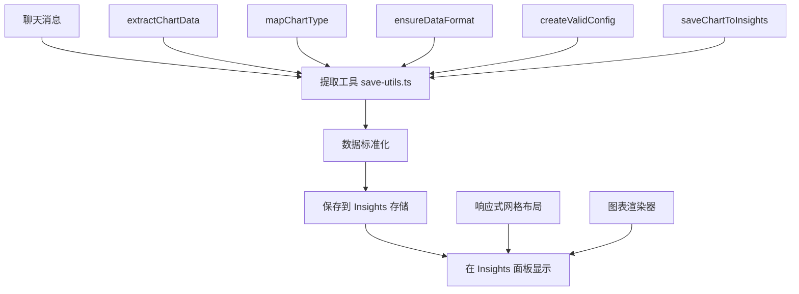

### 2. 数据处理流程

#### 2.1 完整数据流程

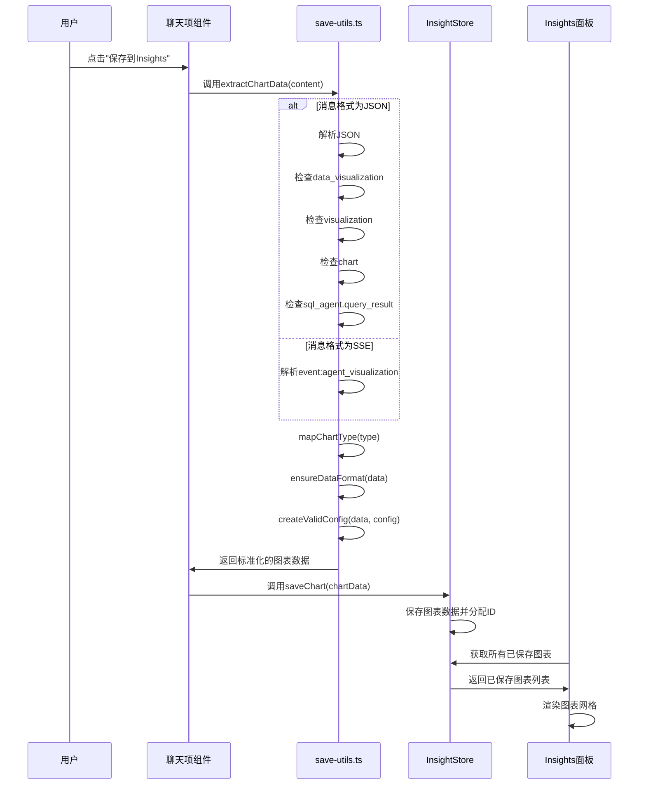

#### 2.2 数据提取和处理流程

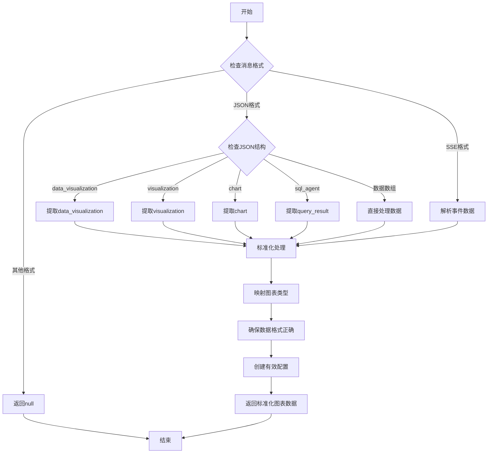

### 3. 组件详细说明

#### 3.1 核心组件: `save-utils.ts`

这是整个数据提取和处理的核心文件，包含以下关键函数:

**3.1.1 `extractChartData`**

```typescript
export function extractChartData(
  content: string,
  messageId: string,
  sessionId: string,
  title: string = "Chart"
): StandardChartData | null
```

**输入参数:**

* `content`: 消息内容字符串
* `messageId`: 消息ID
* `sessionId`: 会话ID
* `title`: 默认图表标题 (可选)

**返回值:**

* 标准化的图表数据对象或null (如果无法提取)

**功能:** 分析消息内容，识别并提取图表数据，支持多种输入格式。

**处理流程:**

1. 检查消息是否为JSON格式
2. 如果是JSON，检查是否包含图表相关字段
3. 如果是SSE格式，解析事件数据
4. 调用其他辅助函数标准化数据
5. 返回标准化的图表数据

**3.1.2 `mapChartType`**

```typescript
function mapChartType(typeStr: string | undefined): "bar" | "line" | "area"
```

**输入参数:**

* `typeStr`: 图表类型字符串或undefined

**返回值:**

* 标准化的图表类型: "bar", "line" 或 "area"

**功能:** 将各种图表类型字符串映射到系统支持的标准类型。

**处理逻辑:**

```mermaid
graph TD
    A[输入图表类型字符串] --> B{是否为空?}
    B -->|是| C[返回"bar"]
    B -->|否| D[转换为小写]
    D --> E{包含"bar"?}
    E -->|是| F[返回"bar"]
    E -->|否| G{包含"line"?}
    G -->|是| H[返回"line"]
    G -->|否| I{包含"area"?}
    I -->|是| J[返回"area"]
    I -->|否| K[返回默认"bar"]
```

**3.1.3 `ensureDataFormat`**

```typescript
function ensureDataFormat(data: any): any[]
```

**输入参数:**

* `data`: 任意格式的数据

**返回值:**

* 标准化的数据数组

**功能:** 确保数据为标准格式的数组，修复缺失或格式不正确的属性。

**处理流程:**

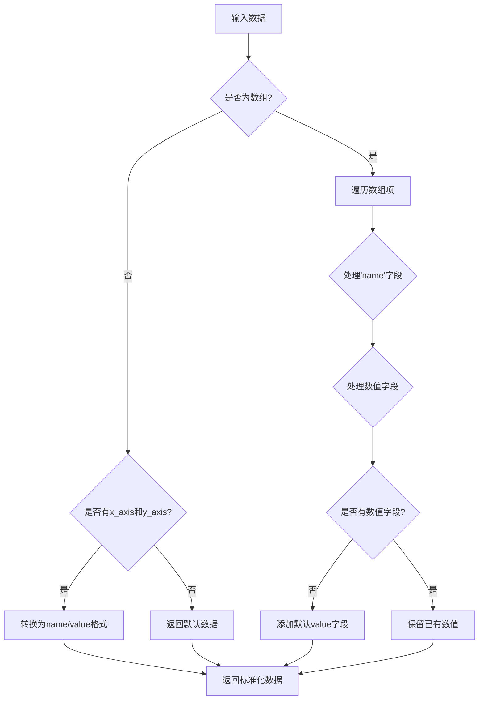

**3.1.4 `createValidConfig`**

```typescript
function createValidConfig(data: any[], existingConfig: any): ChartConfig
```

**输入参数:**

* `data`: 数据数组
* `existingConfig`: 现有配置对象 (可能为空)

**返回值:**

* 有效的图表配置对象

**功能:** 为图表创建有效的配置对象，包括每个数据系列的标签和颜色。

**处理流程:**

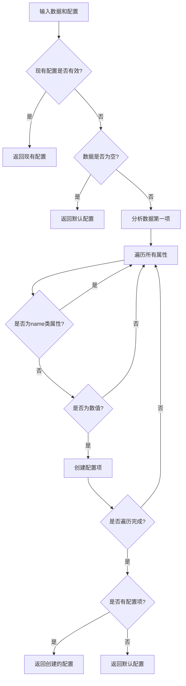

**3.1.5 `saveChartToInsights`**

```typescript
export function saveChartToInsights(
  content: string,
  messageId: string,
  sessionId: string,
  title: string = "Chart"
): boolean
```

**输入参数:**

* `content`: 消息内容
* `messageId`: 消息ID
* `sessionId`: 会话ID
* `title`: 图表标题 (可选)

**返回值:**

* 保存成功或失败的布尔值

**功能:** 整合提取和保存流程，将图表数据保存到 Insights 存储。

**处理流程:**

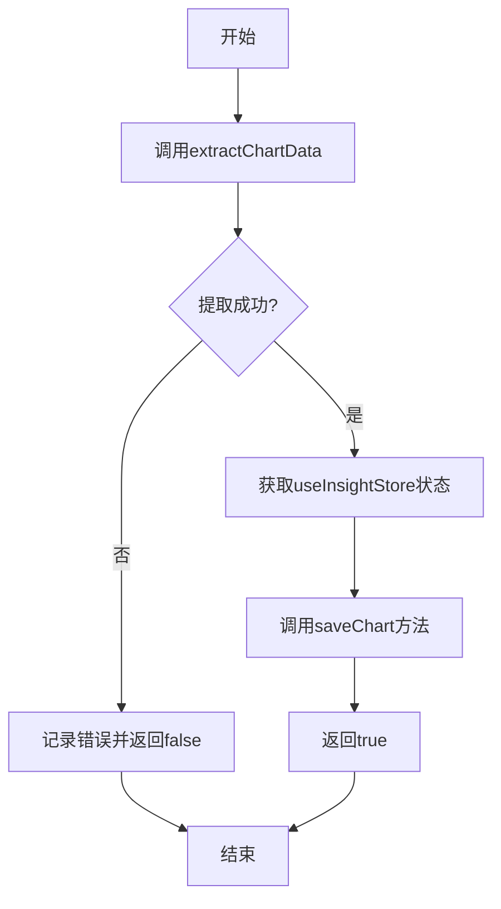

#### 3.2 ChatItem 组件中的集成

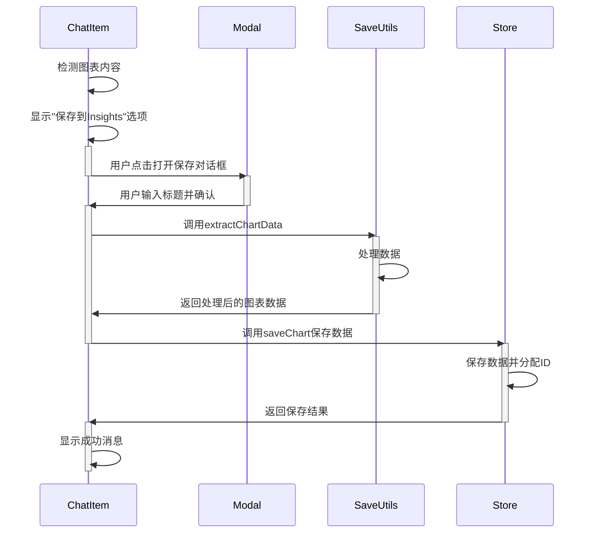

#### 3.3 Insights 页面显示

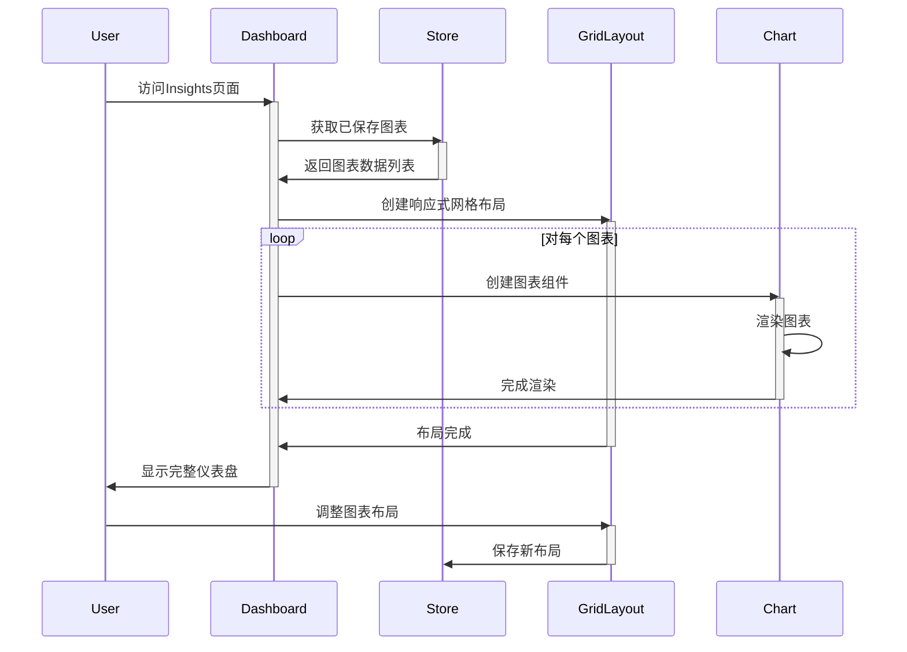

### 4. 数据格式详解

#### 4.1 输入数据格式

系统支持多种输入数据格式，以下是详细说明：

**4.1.1 `data_visualization` 格式**

```json
{
  "data_visualization": {
    "chart_type": "bar_chart",
    "title": "示例图表",
    "description": "这是一个示例",
    "data": [
      {"name": "类别A", "value": 30},
      {"name": "类别B", "value": 45},
      {"name": "类别C", "value": 60}
    ]
  }
}
```

**4.1.2 `visualization` 格式**

```json
{
  "visualization": {
    "type": "line",
    "title": "趋势图",
    "x_axis": "月份",
    "y_axis": "销售额",
    "data": [
      {"category": "一月", "sales": 35},
      {"category": "二月", "sales": 40},
      {"category": "三月", "sales": 30}
    ]
  }
}
```

**4.1.3 `chart` 格式**

```json
{
  "chart": {
    "type": "bar",
    "title": "销售数据",
    "data": [
      {"name": "产品A", "value": 100},
      {"name": "产品B", "value": 150}
    ],
    "config": {
      "value": {
        "label": "销售额",
        "color": "hsl(var(--chart-1))"
      }
    }
  }
}
```

**4.1.4 SQL查询结果格式**

```json
{
  "sql_agent": {
    "query_result": [
      {"product": "产品A", "sales": 100},
      {"product": "产品B", "sales": 150}
    ]
  }
}
```

**4.1.5 SSE 事件格式**

```
event: agent_visualization
data: {
  "content": {
    "data_visualization": {
      "chart_type": "bar",
      "title": "销售分析",
      "data": [
        {"name": "产品A", "value": 100},
        {"name": "产品B", "value": 150}
      ]
    }
  }
}
```

#### 4.2 标准化数据格式

所有输入格式都会被转换为标准格式：

```typescript
interface StandardChartData {
  type: "bar" | "line" | "area";
  data: {
    name: string;
    [key: string]: number | string;
  }[];
  rawData: any[];
  config: {
    [key: string]: {
      label: string;
      color: string;
    }
  };
  title: string;
  description?: string;
}
```

**数据字段说明：**

* `type`: 图表类型，支持 "bar", "line", "area"
* `data`: 标准化的数据数组，每项至少包含 name 和一个数值字段
* `rawData`: 原始数据的备份
* `config`: 配置对象，定义每个数据系列的标签和颜色
* `title`: 图表标题
* `description`: 图表描述（可选）

#### 4.3 保存到 Insights 存储的格式

```typescript
interface SavedChart {
  id: string;  // 系统生成的唯一ID
  messageId: string;  // 来源消息ID
  sessionId: string;  // 来源会话ID
  title: string;  // 图表标题
  description?: string;  // 图表描述
  type: "bar" | "line" | "area";  // 图表类型
  data: any[];  // 标准化数据
  rawData: any[];  // 原始数据
  config: {  // 配置对象
    [key: string]: {
      label: string;
      color: string;
    }
  };
  createdAt: number;  // 创建时间戳
  layout: {  // 在Insights面板中的布局信息
    x: number;  // 网格x坐标
    y: number;  // 网格y坐标
    w: number;  // 宽度单位
    h: number;  // 高度单位
  }
}
```

### 5. 配置项详解

#### 5.1 图表类型配置

系统支持三种标准图表类型：

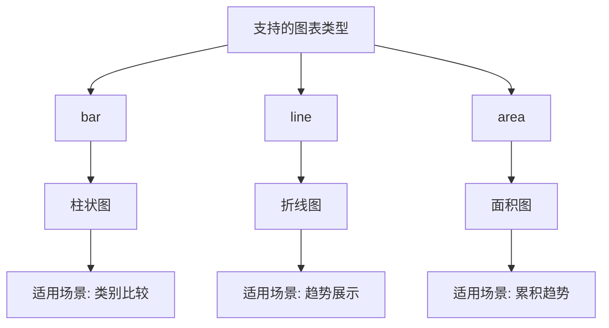

#### 5.2 图表配置对象

每个图表都需要一个配置对象，定义数据系列的展示方式：

```typescript
interface ChartConfig {
  [dataKey: string]: {
    label: string;  // 显示标签
    color: string;  // CSS颜色值
  }
}
```

例如，一个带有多个数据系列的配置对象：

```json
{
  "sales": {
    "label": "销售额",
    "color": "hsl(var(--chart-1))"
  },
  "profit": {
    "label": "利润",
    "color": "hsl(var(--chart-2))"
  },
  "cost": {
    "label": "成本",
    "color": "hsl(var(--chart-3))"
  }
}
```

#### 5.3 Insights 布局配置

Insights 面板使用响应式网格布局，每个图表有以下布局属性：

```typescript
interface ChartLayout {
  x: number;  // 网格横向位置
  y: number;  // 网格纵向位置
  w: number;  // 宽度单位(1-12)
  h: number;  // 高度单位(1-n)
}
```

布局逻辑：

* 默认网格宽度为12单位
* 新图表默认尺寸为 6x4 单位
* 新图表默认放置在现有图表之后
* 用户可以拖拽调整位置和大小

### 6. 实现示例

#### 6.1 提取图表数据

```typescript
// 示例消息内容
const messageContent = `
{
  "data_visualization": {
    "chart_type": "bar_chart",
    "title": "月度销售",
    "data": [
      {"name": "一月", "value": 3000},
      {"name": "二月", "value": 4500},
      {"name": "三月", "value": 6000}
    ]
  }
}`;

// 提取图表数据
const chartData = extractChartData(
  messageContent,
  "msg-123",
  "session-456",
  "默认标题"
);

console.log(chartData);
// 输出:
// {
//   type: "bar",
//   data: [
//     {name: "一月", value: 3000},
//     {name: "二月", value: 4500},
//     {name: "三月", value: 6000}
//   ],
//   rawData: [同上],
//   config: {
//     value: {
//       label: "Value",
//       color: "hsl(var(--chart-1))"
//     }
//   },
//   title: "月度销售",
//   description: ""
// }
```

#### 6.2 保存到 Insights

```typescript
// 保存图表
const success = saveChartToInsights(
  messageContent,
  "msg-123",
  "session-456",
  "自定义标题"
);

console.log(success); // 输出: true

// 内部实现会调用 useInsightStore.getState().saveChart({...})
// 保存的数据会添加 id, createdAt, layout 等字段
```

#### 6.3 在 Insights 面板展示

```tsx
function InsightsDashboard() {
  const { savedCharts } = useInsightStore();
  
  // 生成布局配置
  const layouts = {
    lg: savedCharts.map(chart => ({
      i: chart.id,
      x: chart.layout.x,
      y: chart.layout.y,
      w: chart.layout.w,
      h: chart.layout.h,
    })),
  };
  
  return (
    <div className="insights-dashboard">
      <ResponsiveGridLayout
        layouts={layouts}
        breakpoints={{ lg: 1200, md: 996, sm: 768 }}
        cols={{ lg: 12, md: 10, sm: 6 }}
        rowHeight={100}
        // 其他配置...
      >
        {savedCharts.map(chart => (
          <div key={chart.id}>
            <Card>
              <Chart
                data={chart.data}
                rawData={chart.rawData}
                config={chart.config}
                type={chart.type}
                title={chart.title}
                description={chart.description}
              />
            </Card>
          </div>
        ))}
      </ResponsiveGridLayout>
    </div>
  );
}
```

### 7. 错误处理和调试

#### 7.1 错误处理流程

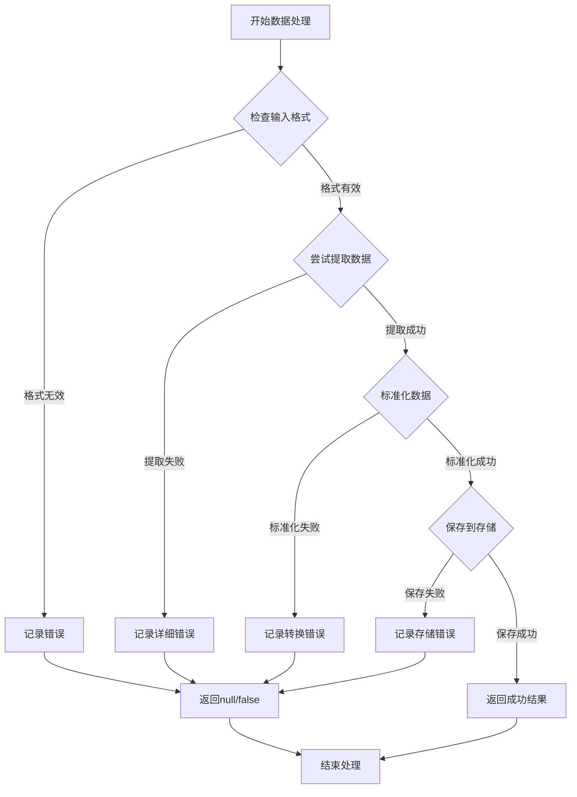

#### 7.2 常见问题和解决方案

**问题1: 数据提取失败**

**症状:** `extractChartData` 返回 null

**可能原因:**

* 消息内容格式不支持
* JSON解析错误
* 缺少必要字段

**调试步骤:**

1. 在控制台记录原始消息内容
2. 尝试手动解析消息内容
3. 检查是否有任何图表相关字段

**解决方案:**

* 添加对更多格式的支持
* 增强错误处理能力
* 改进日志记录

**问题2: 显示默认数据**

**症状:** Insights面板显示默认数据而非实际图表数据

**可能原因:**

* 数据提取成功但保存失败
* 保存时数据格式不正确
* 存储状态管理问题

**调试步骤:**

1. 在控制台记录提取的图表数据
2. 验证保存到存储的调用
3. 检查Insights面板获取数据的逻辑

**解决方案:**

* 修复保存逻辑
* 使用自定义中间件记录存储状态变化
* 添加数据验证

### 8. 性能优化

#### 8.1 数据处理优化

* **懒解析:** 仅在必要时解析JSON数据
* **数据限制:** 限制大型数据集的数据点数量
* **缓存处理结果:** 对于相同消息内容的提取结果进行缓存

#### 8.2 渲染优化

* **懒加载组件:** 使用React.lazy加载图表组件
* **虚拟化列表:** 对于大量图表，使用虚拟化列表
* **防抖处理:** 对布局调整进行防抖处理

#### 8.3 存储优化

* **选择性持久化:** 只持久化必要的图表数据
* **压缩原始数据:** 对原始数据进行压缩处理
* **清理旧数据:** 定期清理长时间未使用的图表数据

### 9. 未来扩展

#### 9.1 支持更多图表类型

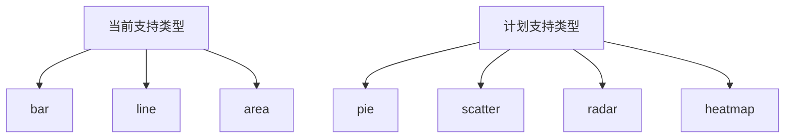

#### 9.2 增强数据转换能力

* 支持更复杂的数据结构
* 添加数据预处理选项
* 支持自定义数据转换逻辑

#### 9.3 改进用户体验

* 添加图表预览功能
* 支持图表编辑功能
* 增加图表分类和标签功能
* 实现图表导入/导出功能

### 10. 总结

本文档详细介绍了图表数据提取与保存的完整实现流程。通过 `save-utils.ts` 工具集，系统能够从各种格式的消息内容中提取图表数据，将其标准化并保存到 Insights 面板中展示。这套系统的优势在于其灵活性和健壮性，能够处理多种数据格式，并提供一致的用户体验。

随着产品的发展，该系统还有很大的扩展空间，可以支持更多图表类型和数据处理功能，进一步提升数据可视化的能力。
